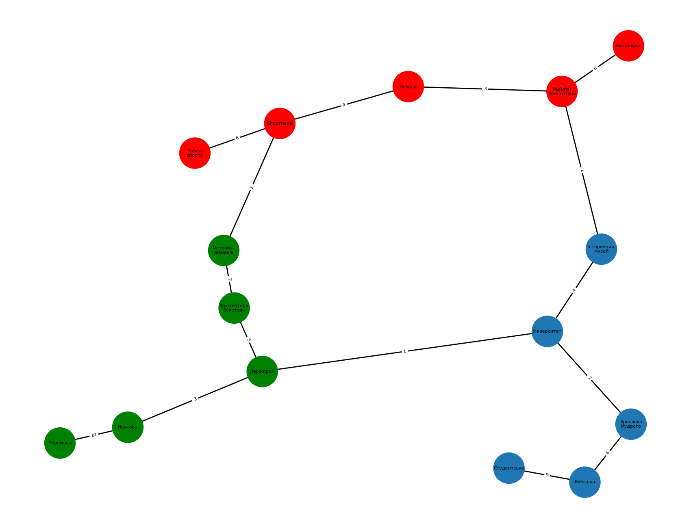

# goit-algo-hw-06
Algo homework 06

## Graph + NetworkX
1. graph_init.py -> Setup of graph (simplified Kharkiv subway system)
2. graph_search.py -> DFS and BFS searches for graph
3. graph_shortest_path.py -> Impementation of Dijkstra algorithm

## Illustration of graph:

## 1. General info about subway graph
    Total number of nodes: 15

    Total number of edges: 15

    Degree of node 'Перемога' is 1
    Degree of node 'Наукова' is 2
    Degree of node 'Держпром' is 3
    Degree of node 'Архітектора
    Бекетова' is 2
    Degree of node 'Метробу-
    дівників' is 2
    Degree of node 'Історичний
    музей' is 2
    Degree of node 'Університет' is 3
    Degree of node 'Ярослава
    Мудрого' is 2
    Degree of node 'Київська' is 2
    Degree of node 'Студентська' is 1
    Degree of node 'Вокзальна' is 1
    Degree of node 'Майдан
    Конституції' is 3
    Degree of node 'Левада' is 2
    Degree of node 'Спортивна' is 3
    Degree of node 'Палац
    спорту' is 1

## 2. Traversion of graph by DFS and BFS
Start point is 'Перемога' station

### DFS path
    [
        ('Перемога', 'Наукова'), 
        ('Наукова', 'Держпром'), 
        ('Держпром', 'Архітектора\nБекетова'), 
        ('Архітектора\nБекетова', 'Метробу-\nдівників'), 
        ('Метробу-\nдівників', 'Спортивна'), 
        ('Спортивна', 'Левада'), 
        ('Левада', 'Майдан\nКонституції'), 
        ('Майдан\nКонституції', 'Вокзальна'), 
        ('Майдан\nКонституції', 'Історичний\nмузей'), 
        ('Історичний\nмузей', 'Університет'), 
        ('Університет', 'Ярослава\nМудрого'), 
        ('Ярослава\nМудрого', 'Київська'), 
        ('Київська', 'Студентська'), 
        ('Спортивна', 'Палац\nспорту')
    ]

### BFS path
    [
        ('Перемога', 'Наукова'), 
        ('Наукова', 'Держпром'), 
        ('Держпром', 'Архітектора\nБекетова'), 
        ('Держпром', 'Університет'), 
        ('Архітектора\nБекетова', 'Метробу-\nдівників'), 
        ('Університет', 'Історичний\nмузей'), 
        ('Університет', 'Ярослава\nМудрого'), 
        ('Метробу-\nдівників', 'Спортивна'), 
        ('Історичний\nмузей', 'Майдан\nКонституції'), 
        ('Ярослава\nМудрого', 'Київська'), 
        ('Спортивна', 'Левада'), 
        ('Спортивна', 'Палац\nспорту'), 
        ('Майдан\nКонституції', 'Вокзальна'), 
        ('Київська', 'Студентська')
    ]

### Traversion login
Starts of both DFS and BFS are the same, 'Перемога', 'Наукова', 'Держпром' and 'Архітектора Бекетова'.
But next step is different for each algorithm. 

In DFS we continue from 'Архітектора Бекетова' to 'Метробудівників', then to 'Спортивна' and further. We go consistently from one node to another, until we have next not visited node. We go this way up to 'Київська'-'Студентська', and only then return to 'Спортивна' - 'Палац спорту', which is last step of our traverse.

On the other hand, in BFS after 'Архітектора Бекетова' we do not go for 'Метробудівників', but instead turn to another neighbour of 'Держпром', which is 'Університет'. Then we go to next neighbour of 'Архітектора Бекетова' ('Метробудівників'), and next neighbours of 'Університет' ('Історичний музей' and 'Ярослава Мудрого'). 
So here we have completly different strategy, compared to DFS, here we go level-by-level.

## 3. Shortest path search
Calculated shortest path, based on Dijkstra algorith:

    {
        'Перемога': 0, 
        'Наукова': 10, 
        'Держпром': 13, 
        'Архітектора\nБекетова': 18, 
        'Метробу-\nдівників': 25, 
        'Історичний\nмузей': 18, 
        'Університет': 14, 
        'Ярослава\nМудрого': 16, 
        'Київська': 20, 
        'Студентська': 29, 
        'Вокзальна': 25, 
        'Майдан\nКонституції': 19, 
        'Левада': 22, 
        'Спортивна': 26, 
        'Палац\nспорту': 32
    }